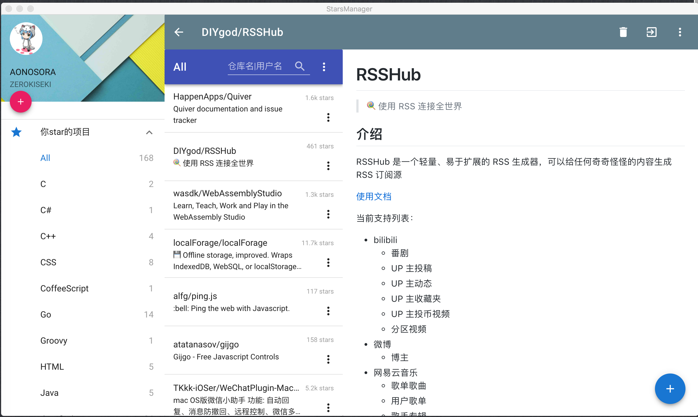
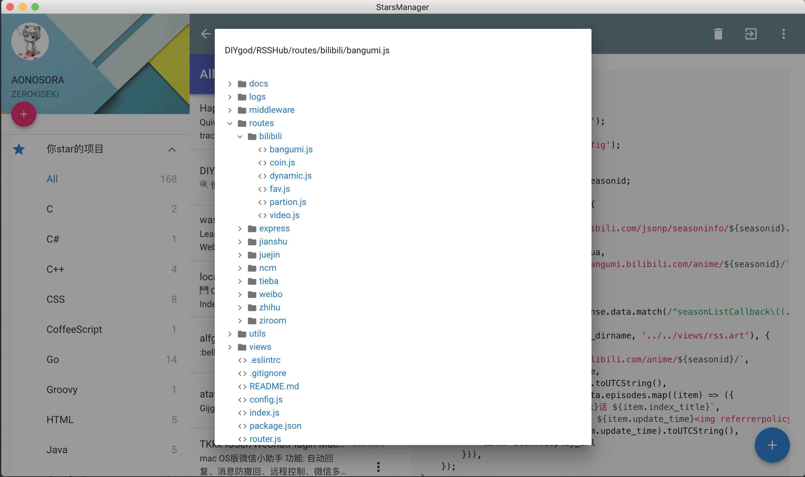
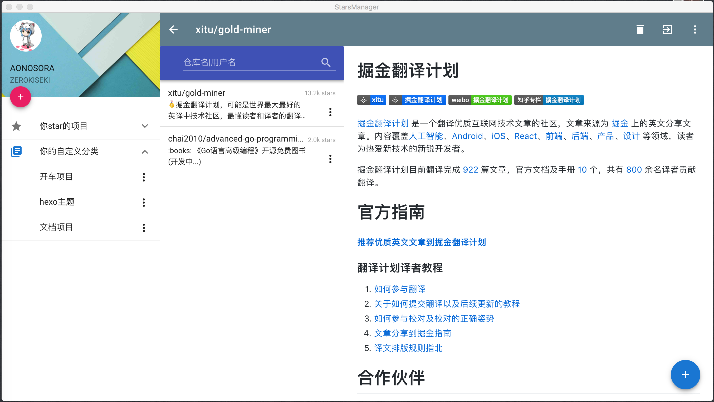

# starsManager

A desktop app that help you to manage your github starred repo.

> [Chinese Introduction](./README_CN.md)

## Preface

---

## Developing Status

Still developing..., You can download it from release(find the version fit your system, and unzip it)

---

## Technology Stack && Main Framework

Vue group technology stack: vue2 + vuex + vue-router  
UI Framework: vuetify.js(a progressive Material Design framework)  
Network request: axios  
Front-end Database: pouchdb  
Module bundler tool: parcel  
Desktop supported: go-astilectron(thanks to [asticode](https://github.com/asticode))  

## Demo:

### See the repo that you have starred:



### See the starred repo tree:



### Customize classification:



### With PouchDB supported, you can see the starred repo contents even in offline state:


---

## How to build:

### Front-end files bundle:

Install parcel global:  

```
yarn global add parcel-bundler

or

npm install -g parcel-bundler

```

Build front-end files: 

```

$ cd src
$ yarn 
$ npm run build

```

### Config of Golang:

Firstly you must have installed Golang environment, and set `GOROOT` and `GOPATH` such on(you can check if you have set them by running `echo $GOROOT`, `echo $GOPATH` in your terminal)

Install go-astilectron and go-astilectron-bundler:  

```
$ go get -u github.com/asticode/go-astilectron
$ go get -u github.com/asticode/go-astilectron-bundler/...
$ go get github.com/ZEROKISEKI/go-astilectron-bootstrap

```

If you meet the problem such as `unrecognized import path "golang.org/x/ ..."` in `go get` progress, you can use mirror library to solve it:

```
$ mkdir -p $GOPATH/src/golang.org/x
$ cd $GOPATH/src/golang.org/x
$ git clone https://github.com/golang/crypto.git
$ git clone https://github.com/golang/net.git
$ git clone https://github.com/golang/sys.git
```

After you successfully run `go get`, you can run the following command to build an app:  

```
$ astilectron-bundler -v
```

Yet it may happen in China: Download electron and astilectron too slow cause failed problem, if happened, you can solve it by the following way:  

Download electron 1.8.1 in [https://github.com/electron/electron/releases?after=v1.8.2-beta.2](https://github.com/electron/electron/releases?after=v1.8.2-beta.2), choose the correct version suit your system  

And then, create a folder in the project, such as `cache_astilectron_bundler`, and rename the electron file you download from release to:

```
electron-windows-amd64-1.8.1.zip(windows system)
electron-darwin-amd64-1.8.1.zip(OSX system)
electron-linux-amd64-1.8.1.zip(linux system)
```

And put the electron file in `cache_astilectron_bundler`.

Then download astilectron 0.20.0 in [https://github.com/asticode/astilectron/releases](https://github.com/asticode/astilectron/releases), putting it in `cache_astilectron_bundler` folder:

And rename astilectron.zip to:

```
astilectron-0.20.0.zip
```

Lastly add the following code in `bundler.json`:

```
"cache_path": "cache_astilectron_bundler"
```

After successfully bundler, you can find your app in the output folder and run it, or you can debug it by running `go *.go`